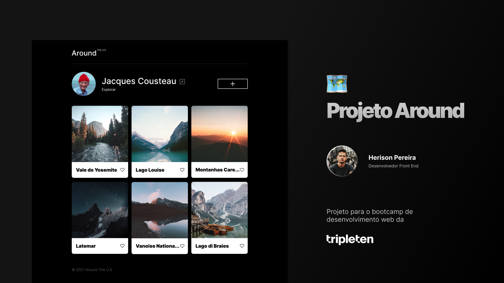

# Tripleten web_project_around

Bootcamp Desenvolvimento Web - TripleTen

- <a href="https://herisonp.github.io/web_project_around/" target="_blank">Veja o deploy</a>

## 👁 Preview

<p align="center">
  
</p>

## 🚀 Tecnologias

Esse projeto foi desenvolvido com as seguintes tecnologias:

- HTML
- CSS
- Responsividade
- JavaScript
- React
- POO (Programação orientada a Objeto)
- Webpack, Babel e PostCSS
- Consumo de API
- Git e GitHub
- Metodoliga BEM

## 💻 Projeto

Projeto criado durante o bootcamp de desenvolvimento web da TripleTen.

## 🧪 Melhorias

Algumas melhorias que podem ser aplicadas:

- Animação em alguns elementos da página para deixar mais dinâmico e interativo
- Salvar alterações do usuário no browser

## ⚙ Instruções para rodar local

Primeiro faça o clone do repositório em seu computador.

Certifique-se de ter o Node em seu computador, na sua versão mais recente. Abra o terminal no diretório do repositório clonado e execute o comando para instalar todas as dependências:

```bash
npm install
```

Após todas dependências instaladas, execute o comando para iniciar o servidor de desenvolvimento:

```bash
npm start
```

Se tudo deu certo, o servidor está pronto para uso. Caso o navegador não abra automaticamente, acesse em seu navegador o endereço local na porta 3000. [http://localhost:3000](http://localhost:3000)
